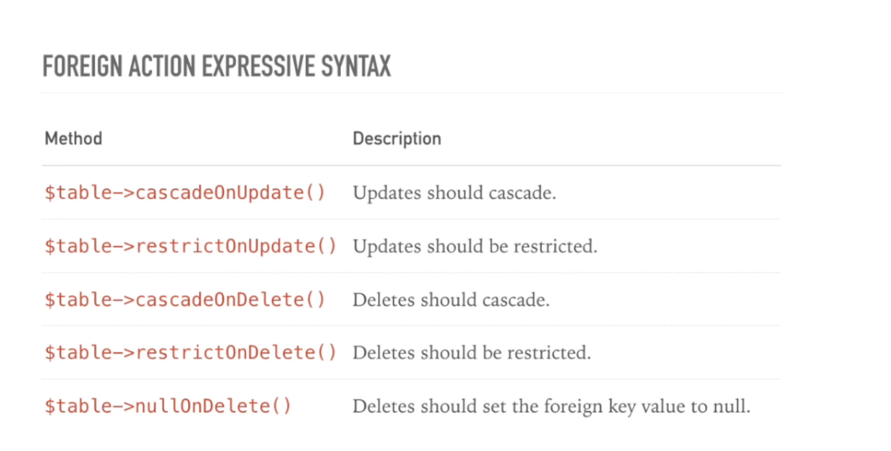

It's very cool

it's a foreign column, when I change in one table with foreign key, this hanges reflet in another table, in chield table

$table->foreign('user_id')->references('id')->on('users')->onUpdate('cascade')->onDelete('cascade');
$table->foreign('user_id')->references('id')->on('users')->onUpdate('cascade')->onDelete('set null');

// I can replace that to ->foreignId() so, will gave us the same type
$table->unsignedBigInteger('user_id')->after('id')->nullable();

// Wil get the primary ket auto ... id
$table->foreignId('user_id')->constrained('users')->onUpdate('cascade')->onDelete('set null');

