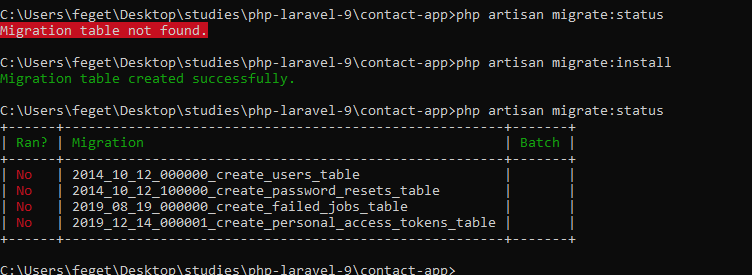
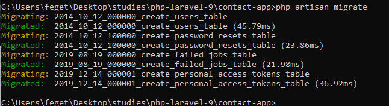

This lesson we will learn about migrations

version controll to control your databse, the database is changing every time
and with migration you don't remember what were changed because we need only run migrations

we have all history of changes on database, if you workig with a team you need only
to do a pull to get their migrations and i will have the same schema database that them

For default we have
create_users_table
create_password_resets_table
create_failed_jobs
create_personal_access_token table

Migration is a class in php and we have up and down... up create, down remove changes

class CreateUsersTable extends Migration
{
    /**
     * Run the migrations.
     *
     * @return void
     */
    public function up()
    {
        Schema::create('users', function (Blueprint $table) {
            $table->id();
            $table->string('name');
            $table->string('email')->unique();
            $table->timestamp('email_verified_at')->nullable();
            $table->string('password');
            $table->rememberToken();
            $table->timestamps();
        });
    }

    /**
     * Reverse the migrations.
     *
     * @return void
     */
    public function down()
    {
        Schema::dropIfExists('users');
    }
}

on database we have the table called migrations, we have all history on migrations in this table
we have 3 columns, ID, migration, batch

ID primary key
migration name of migration executed
batch number of migration, ties that we ran this migration

---

// Create your migration talbe
php artisan migrate:install

// list migrations, if you ran them and batch
php artisan migration:status

// This ommand will scan all migrations folders and to check migrations table on database
// and to execute pending migrations
php artisan migrate

I probaby will receive this error:
SQLSTATE[42000]: Syntax error or access violation: 1071 Specified key was too long; max key length is 767 bytes (SQL: alter table `users` add unique `users_email_unique`(`email`))

you can change on provider and set a default length to a fields in database:
/app/Providers/AppServiceProvider.php

public function boot()
{
    Schema::defaultStringLength(191);
}

After run

If you sant to back your changes you can do a rollback
//With this ommand yu scan all files on migrations folder and execute the method down and remove fom migations table
php artian migrate:rollback
